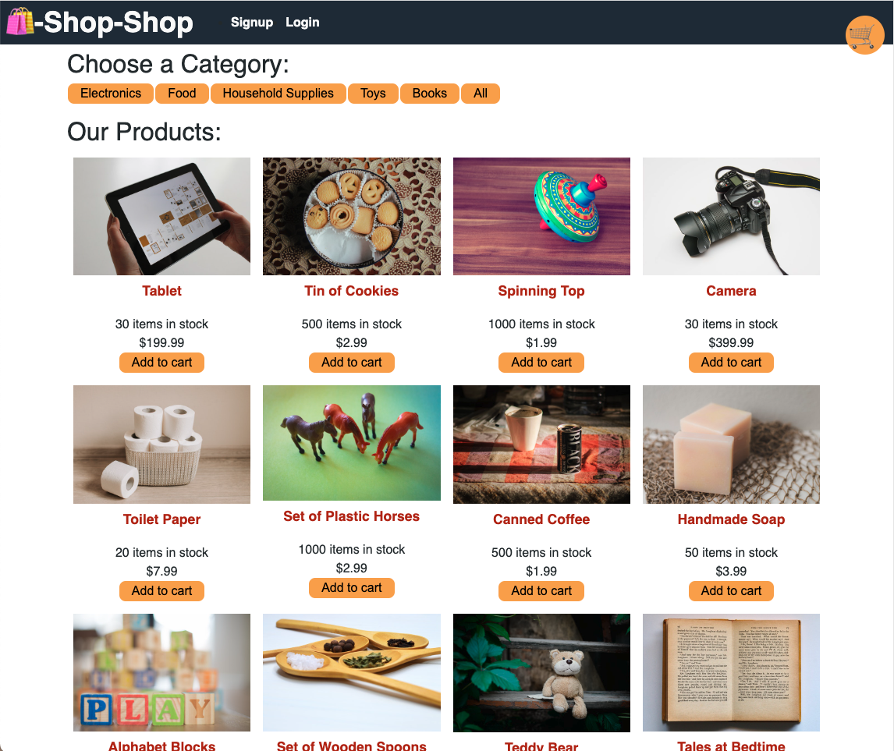
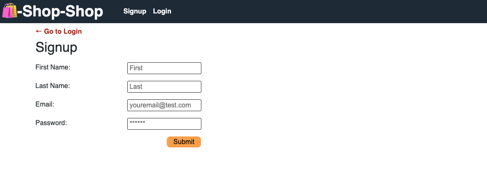
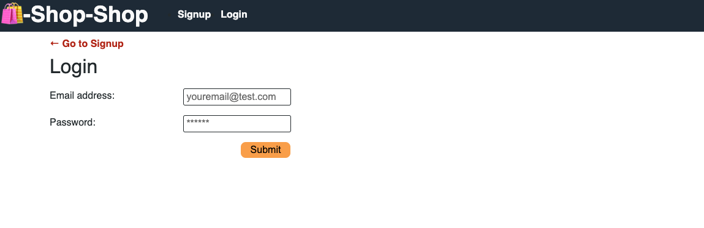
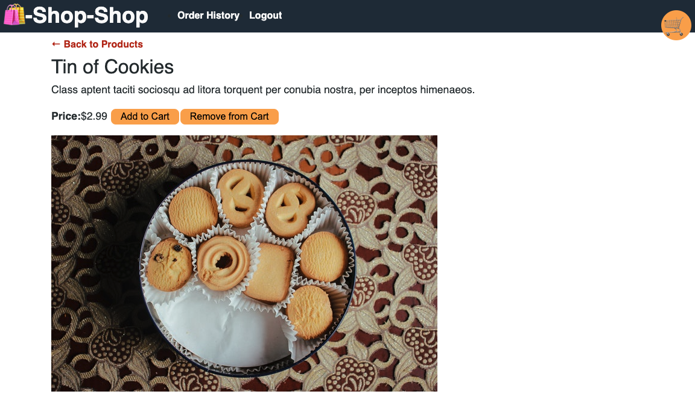
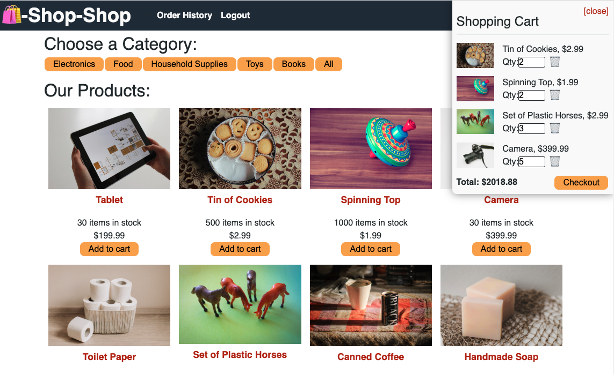
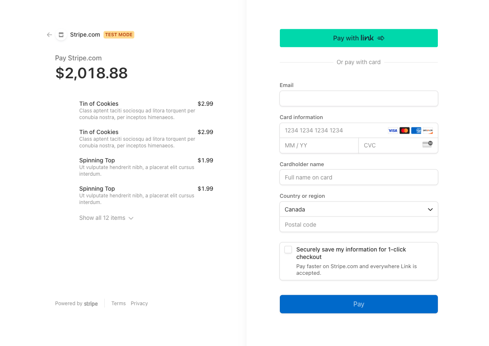

# Shop-Shop Redux Refactor

## Overview

Welcome to Shop-Shop, a cutting-edge e-commerce platform offering a wide range of household goods across various categories. This application has been meticulously refactored to implement Redux for state management, stepping away from the React Context API, to provide a more efficient and scalable solution for handling global state.

## Features

- **User Authentication**: Users can create accounts, sign in, and view their order history.
- **Secure Payments**: Integration with Stripe for secure and reliable payment processing.
- **Product Categories**: Products are organized into categories for easy navigation.
- **Shopping Cart**: Add products to your cart and view them before purchase.
- **Order History**: Signed-in users can view their past orders and purchase details.

## Usage Guide

- **Installation**: Run `npm install` to install all the necessary dependencies.
- **Starting the App**: Execute `npm start` to initiate the app and open it in your default web browser.
- **Shopping**: Browse through the categories, add items to your cart, and proceed to checkout when ready (not a real store, do not actually purchase anything, lol).
- **User Account**: Sign up or log in to view your order history and manage your account settings.

## Screenshots

.
.
.
.
.
.

## Technologies Used

- React
- Redux
- Stripe
- GraphQL/Apollo
- Node.js
- Express

## Live Demo

Check out the live version of this project [here](https://shop-shop-redux-refactor-36970616f69a.herokuapp.com/).

## Credits

This project was accepted and completed as part of the UofT SCS Coding Boot Camp Online: Fullstack Flex PT course through the University of Toronto. The starter code was created by edX Boot Camps LLC and refactored to use Redux by myself, Victoria Alawi.

- **Github**: [@lightoftwelve](https://github.com/lightoftwelve)
- **Portfolio**: [Victoria Alawi's Portfolio](https://victoria-alawi-portfolio.netlify.app/)
- **LinkedIn**: [@Victoria Alawi](https://www.linkedin.com/in/victoria-alawi-872984250/)
- **Website**: [www.lightoftwelve.com](http://www.lightoftwelve.com)

## License

This project is not currently licensed.
